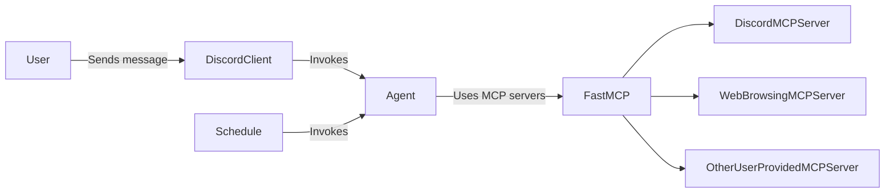

# Contributing

<!-- TODO(#14): Document type checking once all type errors are fixed -->

Thanks for contributing to vercade!

## Getting started

1. Fork the repository
2. Clone your fork
3. Install dependencies: `poetry install`
4. Run tests: `poetry run pytest`
5. Make your changes
6. Lint and format: `poetry run ruff check . && poetry run ruff format .`
7. Run tests: `poetry run pytest`
8. Commit your changes: `git commit -m "feat: add new feature"`
9. Push your changes: `git push`
10. Open a pull request

Please use [conventional commits](https://www.conventionalcommits.org/en/v1.0.0/) for your commit messages

## Architecture

**Tech stack:**

* Python 3.11+
* [Discord.py](https://discordpy.readthedocs.io) listens for new messages
* [LiteLLM](https://docs.litellm.ai/docs/#basic-usage) calls LLMs
* [FastMCP](https://gofastmcp.com) provides an MCP client

**Core components:**

* **Discord client**: Discord bot that listens for new messages
* **Trigger**: Invokes the agent both when a message is received and on a schedule
* **Agent**: LLM agent that can use the user-provided MCP servers
