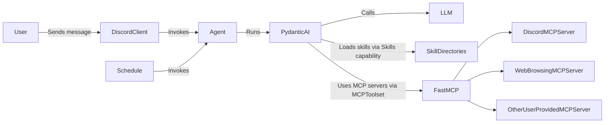

# Contributing

<!-- TODO(#14): Document type checking once all type errors are fixed -->

Thanks for contributing to vercade!

## Getting started

1. Fork the repository
2. Clone your fork
3. Install dependencies: `poetry install`
4. Run tests: `poetry run pytest`
5. Make your changes
6. Lint and format: `poetry run ruff check . && poetry run ruff format .`
7. Run tests: `poetry run pytest`
8. Commit your changes: `git commit -m "feat: add new feature"`
9. Push your changes: `git push`
10. Open a pull request

Please use [conventional commits](https://www.conventionalcommits.org/en/v1.0.0/) for your commit messages

## Architecture


```mermaid
graph LR
    User -->|"Sends message"| DiscordClient
    DiscordClient -->|"Invokes"| Agent
    Schedule -->|"Invokes"| Agent
    Agent -->|"Runs"| PydanticAI
    PydanticAI -->|"Calls"| LLM
    PydanticAI -->|"Loads skills via Skills capability"| SkillDirectories
    PydanticAI -->|"Uses MCP servers via MCPToolset"| FastMCP
    FastMCP --> DiscordMCPServer
    FastMCP --> WebBrowsingMCPServer
    FastMCP --> OtherUserProvidedMCPServer
```

**Tech stack:**

* Python 3.11+
* [Discord.py](https://discordpy.readthedocs.io) listens for new messages
* [Pydantic AI](https://ai.pydantic.dev) loads skills and MCP servers, runs the agent loop and calls LLMs

**Core components:**

* **Discord client**: Discord bot that listens for new messages
* **Trigger**: Invokes the agent both when a message is received and on a schedule
* **Agent**: Thin wrapper around a Pydantic AI agent: builds the system prompt (the identity) and user prompt (the event), maps `VERCADE_LLM_TEMPERATURE`/`VERCADE_LLM_REASONING_EFFORT` to model settings, and exposes the user-provided MCP servers as toolsets and skills as capabilities. MCP tool errors are sent back to the LLM as retry prompts with a large per-tool retry budget (`retries=50`) so a failing tool call doesn't abort the run.

**Tests:** Unit tests (`tests/test_*.py`) are fully offline and use Pydantic AI's `TestModel`/`FunctionModel`: `tests/test_agent.py` covers prompt construction and model settings, `tests/test_skills.py` covers skill directory discovery, and `tests/test_trigger.py` covers `VERCADE_SCHEDULE_INTERVAL` parsing. Everything that needs a real LLM or Discord lives in the end-to-end suite below; `tests/judge.py` provides the LLM judge (`match`) those tests use to grade replies.

## End-to-end tests

The end-to-end suite runs the real bot (as a subprocess) plus a user-stub bot that plays the end user, both connected to a persistent Discord test server. The tests are marked `e2e` and skip automatically when credentials are missing.

**Prerequisites:**

* A second Discord bot token for the user stub
* **Message Content intent enabled in the [Discord Developer Portal](https://discord.com/developers/applications) for both bots** — the stub needs it to read replies, and the `discord-mcp-plus` MCP server needs it to read messages
* Docker (or, to run on the host, Node.js with `npx` on your `PATH`)
* `OPENAI_API_KEY` set in `.env`

Set `VERCADE_E2E_USER_STUB_TOKEN` and `VERCADE_E2E_GUILD_ID` in `.env` (see `template.env`).

**One-time setup:**

Discord bots cannot create servers, so create the test server manually once (suggested name: `vercade-e2e`) and set `VERCADE_E2E_GUILD_ID` to its ID (Developer Mode > right-click the server > Copy Server ID). Then run:

```
poetry run python -m tests.e2e.setup_server
```

The script prints an invite link (server pre-selected) for any bot that has not joined yet or is missing permissions, and waits until both bots are fully set up. The links request exactly the permissions each bot needs; re-opening one for a bot that already joined updates its permissions. Re-runs skip whatever is already done.

**Run:**

The suite is meant to run in the `test` stage of the Dockerfile, which adds Node.js and runs all tests (unit and end-to-end) with a clean home directory:

```
docker build --target test -t vercade-test .
docker run --rm --init --env-file .env vercade-test
```

The bot under test discovers Agent Skills from its home and working directories, so running the suite directly on the host (`poetry run pytest tests/e2e -q`) also loads any skills in your own `~/.agents/skills` or `~/.vercade/skills` into the bot.

The first run downloads the MCP package via `npx` and can take a few minutes.
