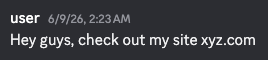
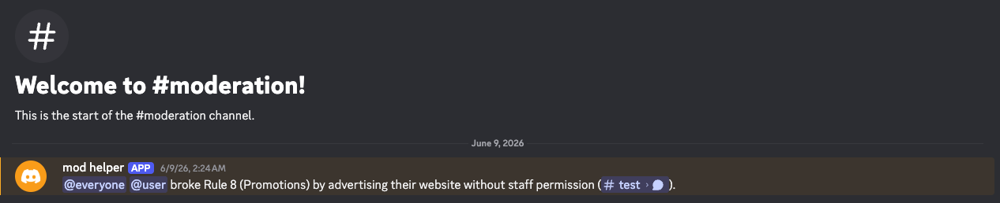

# Vercade

[](https://discord.gg/4fcsGm9sqj)
[](https://aiagentsdirectory.com/agent/vercade "Discover Vercade on AI Agents Directory")

Vercade is a minimal, self-hosted Discord bot for building AI automations. Give it instructions and connect your tools to automate moderation, customer support, and other community tasks.

* **Choose your model:** Use any LLM supported by [Pydantic AI](https://ai.pydantic.dev/models/overview/).
* **Connect external services:** Give the agent tools through MCP servers so it can take action, not just reply.
* **Define its behavior:** Set a custom system prompt and add reusable instructions with [Agent Skills](https://agentskills.io).
* **Automate beyond chat:** Run the agent when messages arrive or on a schedule for recurring tasks.

## Disclaimer

:warning: This project is in early development. It is not yet ready for production use.

## Example use cases

### Moderation

Vercade can be configured to monitor messages in a server and ping the admins when a message clearly breaks one of the server's rules.

Say, a user sends this message in #test:



The bot could message the admins in #moderation:



The admins could then investigate the message and take appropriate action.

### Customer support

Vercade could instead be configured to answer customer support questions that it can confidently answer, grounding its answers in the product's knowledge base.

### General purpose assistant

You could set up Vercade to be a general purpose assistant for your community or private server.

## Quick start

### Discord

1. [Create an app in Discord's developer portal](https://discord.com/developers/applications?new_application=true)
2. Under "Bot", enable the "Message Content Intent" and "Server Members Intent" permissions.
3. Copy the bot token.

### Installation

Clone this repo and run:

```sh
poetry install
cp template.env .env
$EDITOR .env
```

### Running

To start up your bot, run:

```sh
poetry run python -m vercade
```

To run the bot in a Docker container, run:

```sh
docker build -t vercade .
docker run --env-file .env --init --privileged vercade
```

Now, you should be able to invite the bot to your server and start chatting.

## Configuration

### Identity

The `VERCADE_IDENTITY` environment variable is used to configure the bot's personality and behavior. A simple identity might look like this:

```
VERCADE_IDENTITY="You are a funny, intelligent and creative AI Discord user named Sam."
```

More complex identities generally result in more interesting responses.

### Activity

The `VERCADE_ACTIVITY` environment variable can be used to configure the bot's initial presence. It must be a string.

```
VERCADE_ACTIVITY="Ping me!"
```

### Models

The `VERCADE_LLM` environment variable is used to configure the bot's language model. It takes a [Pydantic AI](https://ai.pydantic.dev/models/overview/) model name in the form `<provider>:<model>`:

```
VERCADE_LLM=openai:gpt-5.5
VERCADE_LLM=anthropic:claude-sonnet-5
VERCADE_LLM=google:gemini-3.8-flash
```

The API key is read from the provider's usual environment variable (e.g. `OPENAI_API_KEY`, `ANTHROPIC_API_KEY`, `GOOGLE_API_KEY`). OpenAI, Anthropic, Google, Groq, Mistral, Cohere, Bedrock and Hugging Face work out of the box, as do OpenAI-compatible providers such as `openrouter`, `deepseek`, `ollama`, `together`, `fireworks` and `azure`. Other providers can be enabled by installing the matching extra, e.g. `poetry add "pydantic-ai-slim[xai]"`.

* The `VERCADE_LLM_TEMPERATURE` environment variable is used to configure the LLM's temperature.
* The `VERCADE_LLM_REASONING_EFFORT` environment variable is used to configure the LLM's reasoning effort. It must be one of `minimal`, `low`, `medium`, `high` or `xhigh` (levels unsupported by the provider are mapped to the closest available one).

### Scheduling

Use `VERCADE_SCHEDULE_INTERVAL` to control background, scheduled agent execution. The agent will always respond when messaged regardless of this setting.

- **Default**: `disabled` (no scheduling)
- **Enable**: set to a number of seconds, or a suffix like `15m`, `2h`, etc.

### MCP Servers

The `MCP_PATH` environment variable is required and configures the bot's MCP servers. It should be the path to a Claude MCP JSON config file. Values in the config may reference environment variables as `${VAR}` or `${VAR:-default}`; the bot fails to start if a referenced variable is unset and has no default. Tools are exposed to the LLM prefixed with their server's name (e.g. `discord_send_message`).

```
MCP_PATH=mcp.json
```

**Required MCP Servers:**

* A Discord MCP server ([example](https://www.npmjs.com/package/@quadslab.io/discord-mcp)).

**mcp.json**

```json
{
  "mcpServers": {
    "discord": {
      "command": "npx",
      "args": ["-y", "@quadslab.io/discord-mcp@latest"],
      "env": {
        "DISCORD_TOKEN": "${DISCORD_TOKEN}",
        "DISCORD_GUILD_ID": "${DISCORD_GUILD_ID}"
      }
    }
  }
}
```

### Skills

Vercade automatically loads [Agent Skills](https://agentskills.io) from the standard locations, so skills installed by other compliant clients are picked up without configuration:

* `~/.vercade/skills/` and `~/.agents/skills/` (user-level)
* `./.vercade/skills/` and `./.agents/skills/` (relative to the working directory)

Each skill is a directory containing a `SKILL.md`. The LLM sees every skill's name and description and loads a skill's full instructions on demand. By default, bundled `scripts/`, `references/` and `assets/` are not read or executed. Skills become part of the LLM's instructions, so only install skills you trust. The bot fails to start if a skill is invalid or two skills share a name.

### Logging

The `VERCADE_LOG_LEVEL` environment variable is used to configure the bot's logging level. It must be one of: `DEBUG`, `INFO`, `WARNING`, `ERROR`, `CRITICAL` (default: `WARNING`).

```
VERCADE_LOG_LEVEL=WARNING
```

### Contributing

Please see [CONTRIBUTING.md](CONTRIBUTING.md)

### License

Vercade is open source software released under the [Apache 2.0 license](LICENSE).
